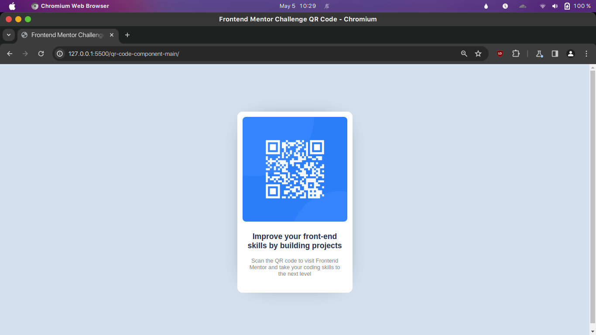

# Frontend Mentor - QR code component solution

This is a solution to the [QR code component challenge on Frontend Mentor](https://www.frontendmentor.io/challenges/qr-code-component-iux_sIO_H). Frontend Mentor challenges helped me improve my coding skills by building realistic projects. 

## Table of contents

- [Overview](#overview)
  - [Screenshot](#screenshot)
  - [Links](#links)
- [My process](#my-process)
  - [Built with](#built-with)
  - [What I learned](#what-i-learned)
- [Author](#author)

**Note: Delete this note and update the table of contents based on what sections you keep.**

## Overview

### Screenshot




### Links

- Solution URL: [qr-code-component-main (GitHub)](https://github.com/Shubhojit-Mitra/qr-code-component-main.git)
- Live Site URL: [qr-code-component-main (GitHub Pages)](https://shubhojit-mitra.github.io/qr-code-component-main)

## My process

### Built with

- Semantic HTML5 markup
- CSS custom properties
- Flexbox


### What I learned

I learned how to structure the HTML properly to create modern layouts and about the  CSS box model.

```html
<div class="something">
  <div class="improve">
    Improve your front-end skills by building projects
  </div>
  <div class="scan-qr">
    Scan the QR code to visit Frontend Mentor and take your coding skills to the next level 
  </div>
</div>  
```
```css
.main {
    width: 300px;
    background-color: white;
    box-shadow: 0px 0px 66px -40px rgba(0,0,0,0.75);
    border-radius: 15px;
    display: flex;
    justify-content: center;
    flex-direction: column;
    padding: 15px;
    padding-bottom: 30px;
}
```


## Author

- LinkedInd - [Add your name here](https://www.linkedin.com/in/shubhojit-mitra-dev)
- Frontend Mentor - [@Shubhojit-Mitra](https://www.frontendmentor.io/profile/Shubhojit-Mitra)

